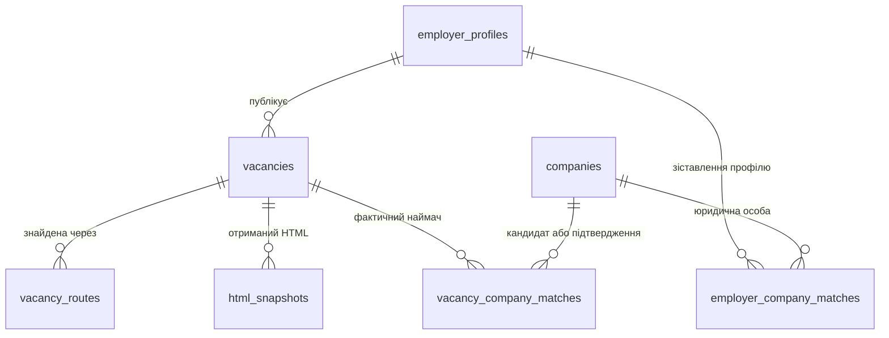

# База вакансій для сайту та аналізу

Схема у `schema.sql` призначена для **PostgreSQL** і окремої бази майбутнього
застосунку. Поточні `data/hh_fast/queue.sqlite3`, HTML, CSV, JSONL і код парсера
не змінені. Дані HH вже завантажені в існуючу спільну схему `public` за
[інструкцією імпорту](SHARED_IMPORT.md). Нижче описаний початковий локальний
проєкт схеми; він не застосовувався у спільній базі.
SQL створює порожню схему `vacancies_app`
один раз; повторний запуск у тій самій базі завершиться помилкою.

## Таблиці та зв'язки



| Таблиця | Що зберігає |
|---|---|
| `vacancies` | Усі 39 наявних колонок останньої повної картки та внутрішні ключі |
| `employer_profiles` | Унікальні профілі публікаторів на HH чи іншому сайті; тип організації спочатку невідомий |
| `vacancy_routes` | Усі пошукові маршрути, через які знайдена одна вакансія |
| `html_snapshots` | Шлях до HTML.gz, URL, час, HTTP-статус і SHA-256 для повторного витягування полів |
| `companies` | Юридичні особи з ГУР та інших джерел: назва, ІПН/ОГРН, джерела, майбутні координати |
| `employer_company_matches` | Зіставлення профілю публікатора з його юридичною особою |
| `vacancy_company_matches` | Окреме зіставлення вакансії з компанією, яка фактично наймає; зокрема клієнтом агенції |

Приклад: вакансію публікує агенція A для заводу B. Профіль HH зв'язується з A
через `employer_company_matches`, а конкретна вакансія — з B через
`vacancy_company_matches`. Якщо наймач невідомий, другого зв'язку немає.
Ім'я публікатора не замінюємо назвою передбачуваного заводу.

## Як використовуються наявні 39 колонок

Усі початкові назви збережені в `vacancies`. Подання
`vacancies_app.vacancy_export` повертає саме ці 39 колонок у порядку CSV.
Це навмисна модель для першого імпорту: оригінальні значення картки зберігаються
разом, а спільний профіль роботодавця винесений окремо. Вона не є повністю
нормалізованою; дублювання employer-полів зберігає те, що було видно у вакансії.

| Група | Колонки | Типи |
|---|---|---|
| Джерело — 8 | `source`, `source_vacancy_id`, `source_url`, `detail_url`, `observed_at`, `published_at_source`, `detail_status`, `source_visibility` | Текст; обидва часи — `timestamptz` |
| Назва — 1 | `title` | `text` |
| Публікатор — 6 | `employer_name`, `employer_name_detail`, `employer_source_id`, `employer_id_namespace`, `employer_profile_url`, `employer_resolution_status` | `text`; ID теж текст |
| Місце — 3 | `region`, `address`, `address_type` | `text` |
| Зарплата — 5 | `salary_from`, `salary_to`, `salary_currency`, `salary_gross`, `salary_period` | Межі — `numeric(18,2)`, gross — nullable `boolean`, решта — `text` |
| Зміст — 8 | `experience`, `description`, `responsibilities`, `requirements`, `conditions`, `education`, `skills`, `schedule` | `text` |
| Публічні ділові контакти — 3 | `public_business_contact_name`, `public_business_phone`, `public_business_email` | Nullable `text` |
| Відбір і походження — 5 | `filter_decision`, `filter_matches`, `discovery_route`, `vpk_status`, `vpk_evidence` | `text`; наявні значення без перекласифікації |

`skills` зараз є готовим рядком, а не надійним масивом: кома може бути частиною
назви однієї навички. Не розбивати його автоматично за комами. Окремі навички
можна додати після витягування вихідного масиву із збереженого HTML.

## Правила майбутнього імпорту

1. Повні картки брати з `data/hh_fast/full_cards.jsonl` — там є всі групи
   відбору, включно з review/excluded. CSV — альтернативний формат тієї ж
   вибірки, його не потрібно імпортувати додатково. `index.jsonl` містить
   короткі записи, а не додаткові повні картки; для нього потрібна окрема
   staging-таблиця, якщо вирішимо переносити ще не завантажені вакансії.
2. Для `source='hh_html'` та майбутнього `hh` API встановлювати однакове
   `source_platform='hh'`. Унікальний ключ вакансії — `(source_platform,
   source_vacancy_id)`. Повторне отримання оновлює цей рядок, не додає дубль.
   Для нового джерела, наприклад Trudvsem, використовувати іншу платформу.
   Одна й та сама робота на різних сайтах сама по собі не зливається.
3. За непорожніх `employer_source_id` і `employer_id_namespace` створити або
   знайти профіль за `(source_platform, id_namespace, source_employer_id)`
   та записати його FK у вакансію. Самої схожості назв для цього недостатньо.
   За відсутнього ID залишати `employer_profile_id=NULL`.
4. `employer_name_detail`, а за його відсутності `employer_name`, можна
   використати як поточний `display_name` профілю. Оригінальні назви залишити
   у картці. `publisher_type='unknown'` до перевірки; категорія агенції також
   потребує джерела, а не лише слова «персонал» у назві.
5. Порожні необов'язкові рядки перетворювати на `NULL`; нульову зарплату та
   `salary_gross=false` не перетворювати на `NULL`. Зберігати часовий пояс через
   `timestamptz`; PostgreSQL нормалізує момент часу, але не зберігає початкове
   написання зсуву. Точний вихідний запис залишається у JSONL/HTML.
6. `salary_period='unspecified_by_source'` не означає зарплату за місяць.
   `region` зараз переважно містить місто/населений пункт, а не суб'єкт РФ.
   Геокодування, координати та адреса підприємства потребують окремого
   джерела: місце вакансії не обов'язково є адресою заводу.
7. Перенести головний `discovery_route` у `vacancy_routes`. Інші маршрути
   брати з `routes` у checkpoint SQLite; їх може не бути у плоскому JSONL.
   Не вигадувати дати маршрутів: якщо SQLite не містить часу першого/останнього
   знаходження, залишити відповідні часові поля `NULL`.
8. HTML-метадані брати зі збережених snapshots/черги. Один лише JSONL не
   містить достатньо інформації для заповнення `html_snapshots`. Зберегти
   доступ до `data/hh_bulk/raw`: частина карток успадкована з попередньої бази.
9. ІПН з картки ГУР належить юридичній особі ГУР. Наявність такого ІПН не
   підтверджує автоматично відповідність профілю HH. До ручної перевірки
   зв'язок — `candidate`, а не `verified`. Для підтвердження SQL вимагає
   непорожній список доказів, ім'я перевіряльника та час перевірки; якість
   доказів оцінює людина.
10. `filter_decision` — результат нашого фільтра, `vpk_evidence` — його
    пояснення. Вони самі по собі не підтверджують належність до ВПК.
    Майбутній NLP записує здогад у `vacancy_company_matches` зі статусом
    `predicted`, методом, версією моделі та оцінкою впевненості. Оцінка не
    вважається каліброваною ймовірністю без окремої перевірки моделі.

У поточній вибірці перевірено 20 075 повних карток; у 20 035 є HH ID профілю,
у 40 його немає. Контакти, освіта та `employer_profile_url` поки порожні.
Тому схема дозволяє `NULL`, не створює вигадані контакти й не вимагає FK для
кожної вакансії. Інші дані, такі як ІПН та координати, — додаткові поля
для майбутнього збагачення, їх немає серед початкових 39 колонок.

Схема зберігає лише останні типізовані поля картки й історію HTML. Якщо
потрібна аналітика змін зарплати/тексту за часом, перед повторним збором треба
додати таблицю версій карток; наявний експорт не є такою історією.

## Приклади запитів

```sql
-- Точна структура нинішнього експорту.
SELECT * FROM vacancies_app.vacancy_export;

-- Картки опубліковані конкретним HH профілем.
SELECT title, region, salary_from, salary_to, source_url
FROM vacancies_app.vacancies
WHERE source_platform = 'hh' AND employer_source_id = '219911';

-- Кандидати ВПК за поточним фільтром (це не підтверджені підприємства).
SELECT title, employer_name_detail, filter_matches, source_url
FROM vacancies_app.vacancies
WHERE filter_decision IN ('candidate_seed_employer', 'candidate_strong_signal');

-- Вакансії із підтвердженим фактичним наймачем.
SELECT v.title, c.legal_name, c.inn, v.source_url, m.evidence
FROM vacancies_app.vacancy_company_matches AS m
JOIN vacancies_app.vacancies AS v ON v.id = m.vacancy_id
JOIN vacancies_app.companies AS c ON c.id = m.company_id
WHERE m.status = 'verified';
```

Індекси підготовлені для пошуку за роботодавцем, відбором, місцем та датою.
Повнотекстовий індекс і PostgreSQL/PostGIS для карти можна додати, коли
визначимо запити сайту. Наявний SQL не вимагає розширень.

## Перевірка

`validation.json` містить результат перевірки всіх 20 075 повних карток:
усі 39 полів збережені, порядок експорту збігається з конфігурацією, ID
вакансій не дублюються, значення зарплати та часу сумісні з обраними типами.
Виявлено 4 718 різних профілів HH і 40 карток без ID профілю.
SQL ще не виконувався на сервері PostgreSQL; ця перевірка підтверджує
відповідність колонок і даних, а не успішне створення бази на сервері.
